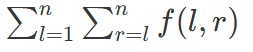

# TBank-Internship
Задания с отбора на стажировку в Т-Банк


## Задание 1
Недавно маленький Антон научился читать некоторые буквы! Точнее, он научился читать буквы S, M, R.
Кроме того, набор из трех букв S, M, R ему кажется правильным, если в нем символ R находится раньше, чем символ M.
Определите, является ли строка  правильной по мнению Антона.

**Формат входных данных**

Дана строка  из трех символов, содержащая один символ R, один символ S и один символ M.

**Формат выходных данных**

Выведите **YES**, если символ R находится в строке раньше, чем символ M. В противном случае выведите **NO**.

## Задание 2
В самый что ни на есть обычный день Борис решил, что на протяжении следующих n дней он будет покупать своей маме букет ровно из трех цветов. Там, где живет Борис, существует всего лишь один магазин цветов, но зато в нем широкий ассортимент: для каждого i от 0 до 10<sup>100</sup> в магазине есть ровно один уникальный цветок, стоящий 2<sup>i</sup> бурлей. К тому же в магазин ежедневно довозят цветы, которые были выкуплены.

В i-й день у Бориса есть a<sub>i</sub> бурлей, которые он готов потратить на букет. Борис хочет купить как можно более дорогой букет. Для каждого из n дней определите, за какую стоимость Борис купит букет, или сообщите, что на его деньги невозможно купить никакой букет из трех цветов.

**Формат входных данных:**
Первая строка содержит число n (`1 <= n <= 10^5`)  — количество дней, в течение которых Борис планирует покупать букеты.

i-я из следующих  строк содержит число a<sub>i</sub> (1 <= a<sub>i</sub> <= 10<sup>18</sup>) — количество бурлей, которое есть у Бориса в -й день.

**Формат выходных данных:**

Для каждого a<sub>i</sub> в отдельной строке выведите, сколько бурлей Борис потратит на букет в i-й день, или -1, если он не может купить никакой букет ровно из трех цветов.

**Пример данных**
| Ввод | Вывод |
|----------|----------|
| 3 | 14   |
| 15   | 67   |
| 67  | -1   |
| 5  |   |

## Задание 3
Чтобы набрать форму к лету, Виктория решила бегать каждый день. До лета осталось всего n дней — именно на протяжении этого срока она и будет бегать. Ее личный тренер уже составил ей расписание: в i-й день Виктория должна пробежать  километров.

Виктория считает i-й (3 <= i <= n) день хорошим, если в этот день она пробежит **не меньше**, чем в первый день, и **не больше**, чем во второй день. Расписание же ей понравится, если хотя бы m дней будут хорошими. В расписании можно делать корректировки: произвольное a<sub>i</sub> (1 < = i <= n) можно увеличить или уменьшить на  километр. Разрешается корректировать один и тот же день несколько раз.

Какое минимальное корректировок необходимо внести в расписание, чтобы оно понравилось Виктории?

**Формат входных данных**

Первая строка содержит числа n `(3 <= n <= 2 * 10^5)`  и m `(1 <= m <= n - 2)`  — количество дней до лета и количество хороших дней, которое необходимо Виктории, чтобы ей понравилось расписание.
Следующая строка содержит числа a<sub>1</sub>, a<sub>2</sub>, ... , a<sub>n</sub> `(1 <= a_i <= 10^9)`, где a<sub>i</sub> — количество километров, которое должна пробежать Виктория согласно начальному расписанию.

**Формат выходных данных**

Выведите одно число — минимальное количество корректировок, которое необходимо внести в расписание, чтобы оно понравилось Виктории.

**Пример данных**
| Ввод | Вывод |
|----------|----------|
| 3 1 | 2   |
| 3 4 6  |


**Комментарий к примеру**

В примере можно дважды уменьшить  a<sub>3</sub> на единицу, чтобы расписание понравилось Виктории.


## Задание 4
Герман немного устал. Вот бы кто-нибудь сделал за него домашнее задание...

Задача, которую необходимо решить Герману, звучит следующим образом. Дана последовательность a<sub>1</sub>, a<sub>2</sub>, ... , a<sub>n</sub> и числа x, y, z

Разрешается произвольное количество (в том числе ноль) раз выполнить следующую операцию: выбрать произвольное (1 <= i <= n)  и увеличить a<sub>i</sub> на единицу.

Необходимо, чтобы **хотя бы один элемент** из последовательности делился на `x`, хотя бы один элемент делился на `y` и хотя бы один элемент делился на `z`. Разрешается, чтобы для разных значений из набора  подходил один и тот же элемент из последовательности.

Помогите Герману отдохнуть перед сессией и найдите минимальное количество операций, которое необходимо выполнить, чтобы условие стало выполнено.

**Формат входных данных**

Первая строка содержит числа n `(1 <= n <= 2 * 10^5)`, x, y, z `(1 <= x, y, z <= 10^6)`

Вторая строка содержить числа a<sub>1</sub>, a<sub>2</sub>, ... , a<sub>n</sub> (1 <= a<sub>i</sub> <= 10^18)

**Формат выходных данных**

Выведите одно число — минимальное количество операций, которое надо выполнить, чтобы для каждого из чисел x, y, z был хотя бы один элемент в последовательности, кратный данному числу.


## Задание 5
На день рождения Дмитрию подарили брусок! На данном бруске Дмитрий обнаружил n - 1 засечку. Данные засечки разбивают брусок на  сегментов. Длина i-го сегмента равняется a<sub>i</sub>.

Дмитрию хочется распилить брусок на маленькие части. Распилы разрешается делать только в местах, в которых есть засечки (но необязательно делать распил там, где есть засечка). Часть считается маленькой, если ее длина не превосходит s. При этом Дмитрию хочется тратить как можно меньше усилий, поэтому он хочет делать как можно меньше распилов.

Не успев приступить к делу, Дмитрий задумался: а если бы ему дали не целый брусок, а его подотрезок, который засечками делился бы на части с длинами a<sub>l</sub>, a<sub>l + 1</sub>, ... , a<sub>r - 1</sub>, a<sub>r</sub>, то на какое количество частей он должен бы был распилить брусок, чтобы каждая часть была маленькая? Такое значение обозначим как `f(l, r)`.

Подумайте вместе с Дмитрием! Посчитайте, чему равняется  


**Формат ввода данных**

Первая строка содержит число n (1 <= n <= 250000) и s (1 <= s <= 10^15)  — количество сегментов, на которые брусок разбит засечками, и максимальную возможную длину куска, чтобы он все еще считался маленьким.

Вторая строка содержит значения a<sub>1</sub>, a<sub>2</sub>, ... , a<sub>n</sub> (1 <= a_i <= min(s, 10^9))  , где a<sub>i</sub> — длина i-го сегмента.

**Замечание про минимальное разбиение**

Если a = [3, 2, 2 и s = 4, то минимальным по размеру будет разбиение на части [3] и [2, 2]. 
Если a = [5, 1, 5, 1, 5, 1, 5] и s = 5, то минимальным по размеру будет разбиение на части [5], [1], [5], [1], [5], [1], [5] 

**Пример входных данных**

Ввод:

```
3 3 
1 2 3
```
Вывод:
```
8
```


**Комментарий про пример**

f(1, 1) + f(1, 2) + f(1, 3) + f(2, 2) + f(2, 3) + f(3, 3) = 1 + 1 + 2 + 1 + 2 + 1 = 8


## Задание 6
В этом году главой Флатландии является Егор. Всего во Флатландии проживает  людей, каждый в своем доме. i-й дом находится в целочисленной точке (x<sub>i</sub>, y<sub>i</sub>).

Егор может выделить некоторые тройки людей. Требуется лишь, чтобы каждый человек относился не более, чем к одной тройке. Тройка людей считается счастливой, если треугольник, образованный их домами, является невырожденным (то есть три дома не находятся на одной прямой).

Помогите Егору определить, какого максимального количества счастливых троек можно добиться во Флатландии.


## Задание 7
-- Будет позже
